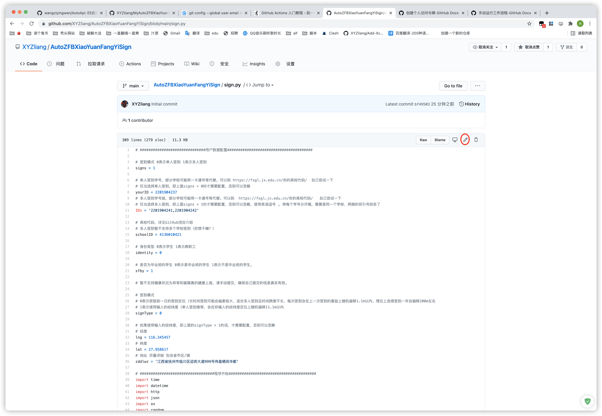
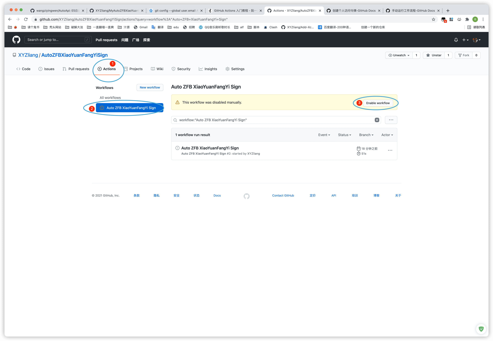
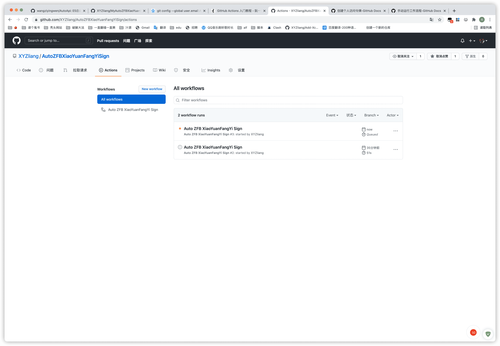
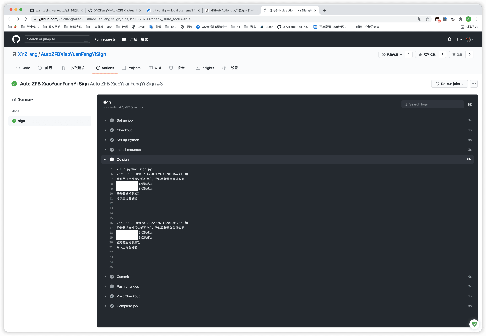
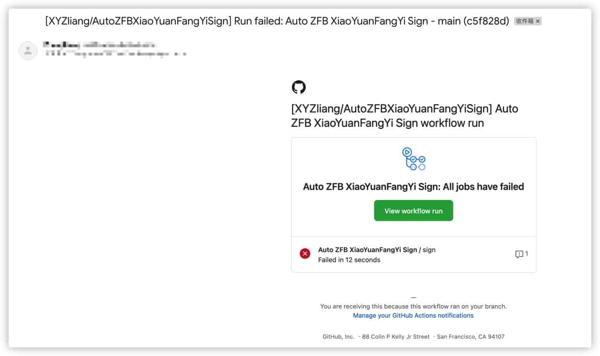
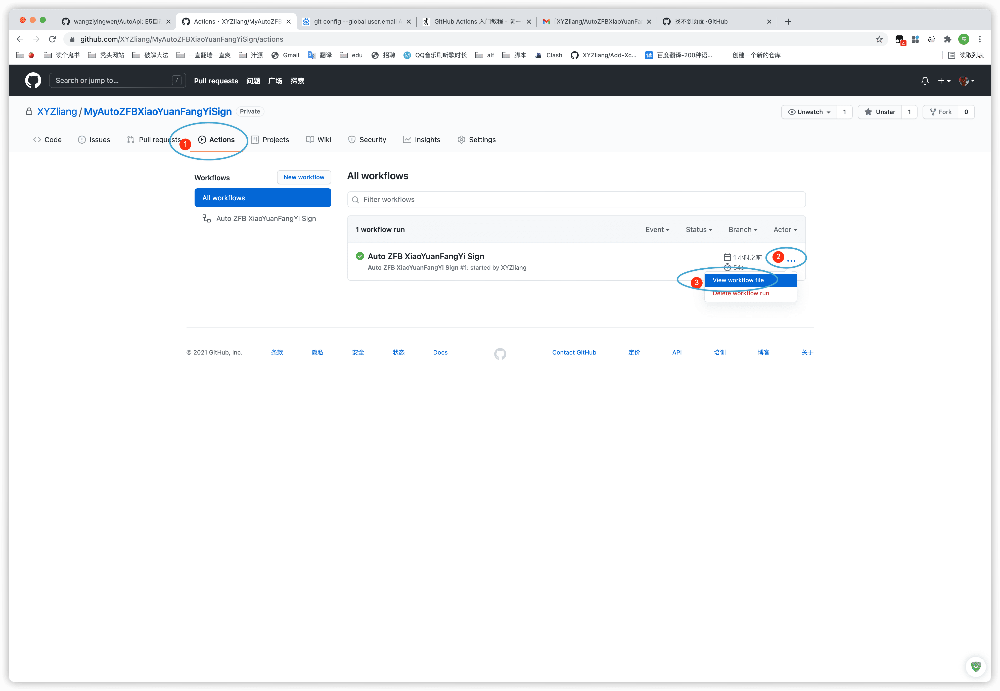

# 🏫 AutoZFBXiaoYuanFangYiSign
> # 本仓库内容仅供学习参考，请不要依赖自动签到，确保自己提交的信息真实有效。参与抗疫人人有责！！！！！！！
> ## 请注意，学校都是我虚构的，我并不是在 **南昌大学** {滑稽}，因为学校标识码它排第一，那我直接用它来举例
Python版本 江西省普通高等学校 校园防疫 健康签到 自动签到程序

# 👴 秃头过程
> 去年疫情期间，根据学校的，在 支付宝 -> 江西省终身学习卡 -> 小程序 -> 校园防疫 -> 健康签到  进行签到
>
> 结果老是忘记被班主任点名
>
> 本身也就是软件专业，直接上手干他！
>
> iPhone使用Thor软件抓包，走一遍流程，发现这个小程序就是个套壳网页。
>
> 测试中发现cookie不会过期，登陆都省了，图方便直接使用苹果的快捷指令app做了一个发送签到请求的POST，再配合苹果的自动化，完成每日签到。
>
> 到了21年寒假，在家闲的胃疼，再加上由于需要帮妹子们（手动狗头）签到，使用快捷指令因为步骤太多很容易失败，于是便有了做程序脚本的想法。再加上个学期的Java学摸鱼摸的有点多，下学期还要学j2ee，就打算使用Java来制作签到脚本。
>
> 但是程序员懂得都懂，Java做脚本。。。。。。蛋疼，虽然没学过python，但是寒假帮闺蜜[抢华为手机摸索写了个python脚本](https://github.com/XYZliang/HUAWEI-STORE-GO)，也就啥都不怕了，肝就完事了。
>
> 写之前在gayhub随手搜了一下，居然发现已经有一位大佬[**@PrintNow**](https://github.com/PrintNow)已经使用PHP制作了一个同款脚本[Jiangxi-University-Health-Check-in](https://github.com/PrintNow/Jiangxi-University-Health-Check-in)。所以本python脚本除了使用python来实现以外，还进行了一些[功能上的优化](https://github.com/PrintNow/Jiangxi-University-Health-Check-in/issues/5)，同时，这个脚本给了我很多的思路和帮助，包括但不限于：
>
> - 免登陆进入系统
> - URL中那串数字
> - 关于`street`参数的描述（[**@ChiuJun**](https://github.com/ChiuJun)）
> - 这个README文档也是从Jiangxi-University-Health-Check-in扒过来修改的哈哈哈哈哈

# 🧀 食用方法
> 很乐意解决你在使用过程中遇到的问题，但我也没系统学过python，只能尽力帮忙，欢迎 [issues](https://github.com/XYZliang/AutoZFBXiaoYuanFangYiSign/issues)，尽量把整个程序以及产生的log文件全部上传。


## A . 部署到自己的服务器 🐂 （适合自己有服务器的童鞋）

1. 克隆或者下载本项目到本地

2. 修改 `sign.py`第4 行签到模式，0表示单人签到 1表示多人签到

3. 如果使用单人签到模式，即第一步signs = 0，则修改 第8 行 的yourID为你的学号。

    否则，如果使用多人签到模式，即第上一步signs = 0，则11 行的 IDs，每个学号之间同英文  ,  分隔开，形如以下的模式：

    ```python
    	IDs = '学号1,学号2,学号3,学号4'
    ```

    

    *Ps:部分学校可能用一卡通号等代替。可以到 [https://fxgl.jx.edu.cn/你的高校代码/]( https://fxgl.jx.edu.cn/你的高校代码/)   自己尝试一下，（你的高校代码 详见后文 **江西省100所高校代码**）*

4. 修改第15 行 学校代码（详见后文 **江西省100所高校代码**）

5. 修改第18 行 身份类型（0表示学生 1表示教职工）（*暂不支持教职工，部分细节有差异，如果有老师需要可以提交issues我再修改*）

6. 修改第21 行 是否为毕业班级（0表示是毕业班的学生 1表示不是毕业班的学生）

7. 修改第28 行 签到模式 （0表示获取前一日的签到定位，1表示使用输入的经纬度）

    > 因为为了使签到位置产生一点点差异，每次签到都会随机偏移一点。
    >
    > 如果获取前一日的签到定位进行签到，长时间签到可能会偏差较大，适合多人签到且时间跨度不是不长。每次签到会在上一次签到的基础上随机偏移1.1m以内，理论上连续签到一年会偏移200m左右
    >
    > 使用输入的经纬度，单人签到推荐，会在你输入的经纬度定位上随机偏移11.1m以内

8. 如果使用输入的经纬度模式，即上一步中的参数 `signType = 1`,则还需要配置32行和34行的经纬度、36行的地址，建议在[*百度拾取坐标系统*](http://api.map.baidu.com/lbsapi/getpoint/index.html)找到自己的位置。经度是较大的那个。

9. 如果需要server酱推送，可在第38-46行了解详情并配置

10. 部署到虚拟主机或者本机，然后cd到相关文件夹，运行命令 ` python3 sign.py`  即可
    ```bash
    # Ubuntu 安装 python3 方法，其它如 CentOS 可以网上搜
    sudo apt install python3
    sudo apt install python3-pip
    #安装完成后继续配置python
    pip3 install requests
    ```

11. 对于liunx系统，建议使用 `crontab` 定时运行上述命令。Windows可以使用定时任务，macOS也有定时。
     > `crontab` 使用方法可以网上查找资料

     
## B . **部署免费GITHUB服务器（Github Workflows）🔥**  （！！推荐！！）（适合自己没有服务器的童鞋）

1. 克隆/派生本项目到你自己的仓库

2. 克隆你的项目到本地，在本地编辑sign.py，同A方案的2-9步骤，然后提交回去

   或者直接在GitHub上编辑sign.py并保存

   
   
3. 点开你项目的Actions，点击左侧Workflows-All workflows-Auto ZFB XiaoYuanFangYi Sign，点击黄色警示⚠️条右边的Enable workflow

   

4. 至此，GitHub workflow已经成功开启。默认理想情况下将会在每天的凌晨0点半、9点半、18点半进行三次签到。如果想修改定时时间，可以看下一部分。

## C . 部署到腾讯云云函数（免费） 🦄

自己研究咯，只是以前知道这玩意也能免费定时运行代码。

# 🏪关于GitHub workflow的更多说明

## 测试一下，怎么知道自己的能不能正常运行呢？

在成功编辑完sign.py和打开workflow后，每次 提交一次push，就可以手动出发运行workflow。此时打开项目的Action，就会发现出了一个新的workflow正在运行或刚刚运行完毕，点击即可查看详情。

点击Do sign可以查看运行详情，当然，每次运行，你的仓库log文件夹下也会自动生成了日志文件，可以进行查看。

如果你配置了SERVER酱，也会将签到日志一起推送。



如果运行失败，你的GitHub绑定的邮箱会收到相关提醒。



以上不仅适用于手动出发的action，每天自动运行的action也是一样的。

## 怎么修改定时运行的时间？

打开Action，找到一个运行的记录，点击右侧的三个点，再点击View workflow file（推荐）

或者在项目中打开文件夹.github/workflows/autosign.yml



然后点击右上角的笔进入编辑，在第十二行找到：

```shell
    - cron: '30 */9 * * *'
```

至于cron的用法，大家具体百度。要注意的是，这里的时间是UTC协调世界时，简单的说，就是要在你理解的北京时间上减去8小事。比如凌晨一点，这里你要输入17点（｜1点-8小时｜），凌晨十二点，这里你要输入16点（｜0点-8小时｜），随后右上角提交即可。

注意！github action存在一定的延迟，测试发现可能是几分钟，也可能是几十分钟，也可能是一个多小时。所以到了定时时间却没有运行请不必担心，等一天你再看看。


# ❗ 关于 ``street`` 参数与 ``zddlwz`` 参数（平常使用支付宝和微信进行签到的童鞋直接略过）

## 原项目文档描述：

> 基于对签到数据的改动较以往数据尽量小的原则，作详细说明（感谢原项目  [@ChiuJun](https://github.com/ChiuJun) > 
>[issues: street参数确定是可选项吗？](https://github.com/PrintNow/Jiangxi-University-Health-Check-in/issues/2#issuecomment-672447041) ）  
> 定位部分为三个环境：

1. 支付宝环境  
支付宝环境需要 ``street`` 参数，参考[支付宝H5开放文档](https://myjsapi.alipay.com/jsapi/native/get-current-location.html)   
   ``street`` 参数由返回结果的 ``pois[0].address`` 与 ``pois[0].name`` 拼接而成，最后再拼接成 ``address.zddlwz`` 
    ```JavaScript
    address.street = result.pois[0].address + result.pois[0].name;
    //...
    var zddlwz =address.province+address.city+address.district+address.street;
    ```
    而 ``Singleton.php`` 中 ``$street`` 为空，并且没有将 ``$street`` 拼接至 ``zddlwz``  ,所以造成了本签到程序提交的**签到记录中缺失具体的街道信息**。  
    考虑到大部分人的环境都是支付宝，***建议将具体的街道信息加入到POST参数中***  
    修改 `Singleton.php` 第 92 行为
    ```JavaScript
    "zddlwz" => $province . $city . $district . $street,//自动地理位置：省市县(区)街道 拼接结果
    ```
2. 微信环境  
微信环境中同样需要 ``street`` 参数，并且不同于支付宝环境，微信环境中 ``street`` 参数不包含 ``streetNumber`` 信息，拼接地理位置时 ``zddlwz`` 同样需要详细到街道号。  
    至于 ``street`` 参数中具体填什么，建议自行查看微信小程序开发者文档。
   
    ```JavaScript
    address.street = addComp.street;
    //...
    address.zddlwz = addComp.province+addComp.city+addComp.district+addComp.street+addComp.streetNumber;
    ```

3. H5环境  
    H5环境 ``street`` 参数为可选项，对于H5环境的同学，不需要对 ``Singleton.php`` 做额外更改。
    ```JavaScript
    var addressStr = address.province + address.city + address.district;
    ```
## 备注：由于据了解大家基本上都是使用的支付宝环境，所以本脚本不对H5环境，也就是通过浏览器进行签到的情况不做适配。（我感觉没有使用浏览器签到的，大家应该都是用的支付宝吧，如果有，提交issues，我再进行适配。）

# 🎨 相关 API 说明

1. 登录 API
   
   [https://fxgl.jx.edu.cn/学校标识码/public/homeQd?loginName=你的学号&loginType=0](https://fxgl.jx.edu.cn/学校标识码/public/homeQd?loginName=你的学号&loginType=0)
       
   
2. 签到 API

    [https://fxgl.jx.edu.cn/学校标识码/studentQd/saveStu](https://fxgl.jx.edu.cn/学校标识码/studentQd/saveStu    )    

    

3. 签到记录页面

    [https://fxgl.jx.edu.cn/学校标识码/public/xslby](https://fxgl.jx.edu.cn/学校标识码/public/xslby)

    

4. 是否签到

    [https://fxgl.jx.edu.cn/学校标识码/studentQd/studentIsQd](https://fxgl.jx.edu.cn/学校标识码/studentQd/studentIsQd)

    data为1即为已经签到

    

5. 签到记录API

    [https://fxgl.jx.edu.cn/学校标识码/studentQd/pageStudentQdInfoByXh](https://fxgl.jx.edu.cn/学校标识码/studentQd/pageStudentQdInfoByXh)

    

6. 百度地图API

    [http://api.map.baidu.com/reverse_geocoding/v3/ak=80smLnoLWKC9ZZWNLL6i7boKiQeVNEbq&output=json&coordtype=wgs84ll&location=纬度,经度](http://api.map.baidu.com/reverse_geocoding/v3/ak=80smLnoLWKC9ZZWNLL6i7boKiQeVNEbq&output=json&coordtype=wgs84ll&location=纬度,经度)

    从这个签到系统里提取出的ak，正好省了我们去申请

# 🙇‍ 感谢名单
> 感谢它们对本项目做出的贡献
- [@ChiuJun](https://github.com/ChiuJun)

- [@PrintNow](https://github.com/PrintNow)

- 某位一直帮助我的大三学长

# 💻测试环境

系统：macOS Big Sur 11.3 BETA    ubuntu18.04

python版本：Python 3.9

# 🙋‍♀️ 未来计划

> 可能会有，可能不会有

- [x] 加入多人签到的完整支持
- [x] 支持通过server酱进行签到成功/失败通知
- [x] 配合GitHub Action达到利用GitHub来做服务器免费进行签到
- [x] 通过获取上一次的签到记录进行签到，并进行随机偏移
- [ ] 支持通过QQ机器人（httpAPI）插件进行签到成功/失败通知

# 🤹‍♂️ 更新记录

- 2021.2.16

  初代版本，实现单人签到主要功能

- 2020.2.18

  加入对多人签到的支持，修复部分逻辑，解决大部分警告
  
- 2020.2.18
  
  加入对GitHub workflows以达到免自己服务器进行云定时签到的支持
  
- 2020.2.19
  
  加入对SERVER酱推送的支持，log更加详细，修复GitHub workflows的一些小bug
  
  

# 🏫 江西省100所高校代码

> ‼‼‼ 人工摘抄可能有遗漏的地方，具体请以实际为准
>
> 快捷键 `CTRL + F` 可快速搜索你的学校
>
> 数据来源于：http://www.moe.gov.cn/srcsite/A03/moe_634/201706/t20170614_306900.html

| 学校名称                      | 学校标识码 | 所在地   |
| ----------------------------- | ---------- | -------- |
| 南昌大学                      | 4136010403 | 南昌市   |
| 华东交通大学                  | 4136010404 | 南昌市   |
| 东华理工大学                  | 4136010405 | 抚州市   |
| 南昌航空大学                  | 4136010406 | 南昌市   |
| 江西理工大学                  | 4136010407 | 赣州市   |
| 景德镇陶瓷大学                | 4136010408 | 景德镇市 |
| 江西农业大学                  | 4136010410 | 南昌市   |
| 江西中医药大学                | 4136010412 | 南昌市   |
| 赣南医学院                    | 4136010413 | 赣州市   |
| 江西师范大学                  | 4136010414 | 南昌市   |
| 上饶师范学院                  | 4136010416 | 上饶市   |
| 宜春学院                      | 4136010417 | 宜春市   |
| 赣南师范大学                  | 4136010418 | 赣州市   |
| 井冈山大学                    | 4136010419 | 吉安市   |
| 江西财经大学                  | 4136010421 | 南昌市   |
| 江西科技学院                  | 4136010846 | 南昌市   |
| 景德镇学院                    | 4136010894 | 景德镇市 |
| 萍乡学院                      | 4136010895 | 萍乡市   |
| 江西科技师范大学              | 4136011318 | 南昌市   |
| 南昌工程学院                  | 4136011319 | 南昌市   |
| 江西警察学院                  | 4136011504 | 南昌市   |
| 新余学院                      | 4136011508 | 新余市   |
| 九江学院                      | 4136011843 | 九江市   |
| 江西工程学院                  | 4136012766 | 新余市   |
| 南昌理工学院                  | 4136012795 | 南昌市   |
| 江西应用科技学院              | 4136012938 | 南昌市   |
| 江西服装学院                  | 4136013418 | 南昌市   |
| 南昌工学院                    | 4136013421 | 南昌市   |
| 南昌大学科学技术学院          | 4136013429 | 南昌市   |
| 南昌大学共青学院              | 4136013430 | 九江市   |
| 华东交通大学理工学院          | 4136013431 | 南昌市   |
| 东华理工大学长江学院          | 4136013432 | 抚州市   |
| 南昌航空大学科技学院          | 4136013433 | 南昌市   |
| 江西理工大学应用科学学院      | 4136013434 | 赣州市   |
| 景德镇陶瓷大学科技艺术学院    | 4136013435 | 景德镇市 |
| 江西农业大学南昌商学院        | 4136013436 | 南昌市   |
| 江西中医药大学科技学院        | 4136013437 | 南昌市   |
| 江西师范大学科学技术学院      | 4136013438 | 南昌市   |
| 赣南师范大学科技学院          | 4136013439 | 赣州市   |
| 江西科技师范大学理工学院      | 4136013440 | 南昌市   |
| 江西财经大学现代经济管理 学院 | 4136013441 | 南昌市   |
| 豫章师范学院                  | 4136013774 | 南昌市   |
| 南昌师范学院                  | 4136014437 | 南昌市   |
| 上饶幼儿师范高等专科学校      | 3636000312 | 上饶市   |
| 抚州幼儿师范高等专科学校      | 3636000519 | 抚州市   |
| 江西工业职业技术学院          | 4136010839 | 南昌市   |
| 江西医学高等专科学校          | 4136010888 | 上饶市   |
| 九江职业大学                  | 4136011505 | 九江市   |
| 九江职业技术学院              | 4136011785 | 九江市   |
| 江西司法警官职业学院          | 4136012929 | 南昌市   |
| 江西陶瓷工艺美术职业技术 学院 | 4136012930 | 景德镇市 |
| 江西旅游商贸职业学院          | 4136012932 | 南昌市   |
| 江西电力职业技术学院          | 4136012933 | 南昌市   |
| 江西环境工程职业学院          | 4136012934 | 赣州市   |
| 江西艺术职业学院              | 4136012936 | 南昌市   |
| 鹰潭职业技术学院              | 4136012937 | 鹰潭市   |
| 江西信息应用职业技术学院      | 4136012939 | 南昌市   |
| 江西交通职业技术学院          | 4136012940 | 南昌市   |
| 江西财经职业学院              | 4136012941 | 九江市   |
| 江西应用技术职业学院          | 4136012942 | 赣州市   |
| 江西现代职业技术学院          | 4136012943 | 南昌市   |
| 江西工业工程职业技术学院      | 4136012944 | 萍乡市   |
| 江西机电职业技术学院          | 4136012976 | 南昌市   |
| 江西科技职业学院              | 4136013419 | 南昌市   |
| 南昌职业学院                  | 4136013420 | 南昌市   |
| 江西外语外贸职业学院          | 4136013422 | 南昌市   |
| 江西工业贸易职业技术学院      | 4136013423 | 南昌市   |
| 宜春职业技术学院              | 4136013424 | 宜春市   |
| 江西应用工程职业学院          | 4136013425 | 萍乡市   |
| 江西生物科技职业学院          | 4136013426 | 南昌市   |
| 江西建设职业技术学院          | 4136013427 | 南昌市   |
| 抚州职业技术学院              | 4136013428 | 抚州市   |
| 江西中医药高等专科学校        | 4136013775 | 抚州市   |
| 江西先锋软件职业技术学院      | 4136013776 | 南昌市   |
| 江西经济管理职业学院          | 4136013866 | 南昌市   |
| 江西制造职业技术学院          | 4136013867 | 南昌市   |
| 江西工程职业学院              | 4136013868 | 南昌市   |
| 江西青年职业学院              | 4136013869 | 南昌市   |
| 上饶职业技术学院              | 4136013870 | 上饶市   |
| 江西航空职业技术学院          | 4136013871 | 南昌市   |
| 江西农业工程职业学院          | 4136013872 | 宜春市   |
| 赣西科技职业学院              | 4136013873 | 新余市   |
| 江西卫生职业学院              | 4136013965 | 南昌市   |
| 江西新能源科技职业学院        | 4136014166 | 新余市   |
| 江西枫林涉外经贸职业学院      | 4136014167 | 九江市   |
| 江西泰豪动漫职业学院          | 4136014168 | 南昌市   |
| 江西冶金职业技术学院          | 4136014241 | 新余市   |
| 江西管理职业学院              | 4136014249 | 南昌市   |
| 江西传媒职业学院              | 4136014250 | 南昌市   |
| 江西工商职业技术学院          | 4136014321 | 南昌市   |
| 景德镇陶瓷职业技术学院        | 4136014402 | 景德镇市 |
| 共青科技职业学院              | 4136014403 | 九江市   |
| 赣州师范高等专科学校          | 4136014465 | 赣州市   |
| 江西水利职业学院              | 4136014476 | 南昌市   |
| 宜春幼儿师范高等专科学校      | 4136014494 | 宜春市   |
| 吉安职业技术学院              | 4136014504 | 吉安市   |
| 江西洪州职业学院              | 4136014505 | 宜春市   |
| 江西师范高等专科学校          | 4136014537 | 鹰潭市   |
| 南昌影视传播职业学院          | 4136014544 | 南昌市   |
| 赣南卫生健康职业学院          | 4136014569 | 赣州市   |
